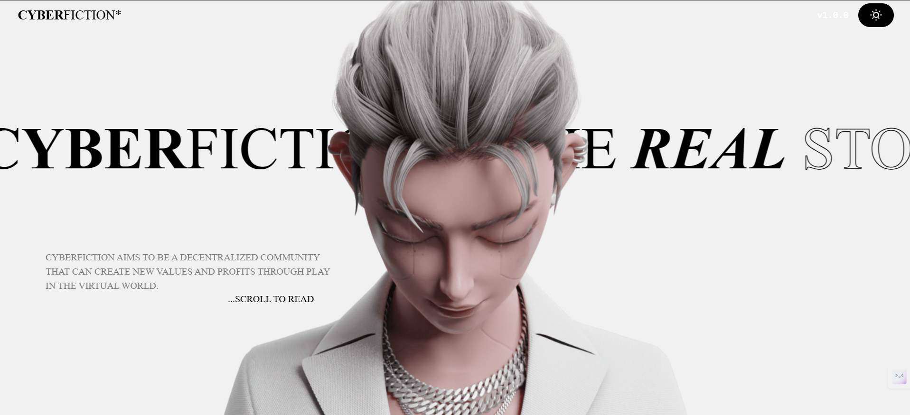
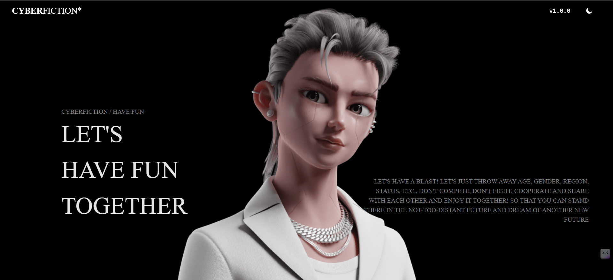

# ⚡ Cyberfiction Frontend

You can view it live here: [https://cyberfictionui.netlify.app](https://cyberfictionui.netlify.app)

This project is a **learning experiment** focused on **animations, scroll effects, and interactive UI design**.  
It is inspired by **Cyberfiction** — a futuristic digital world that blends storytelling, technology, and immersive design.

The goal of this project was to practice **frontend development with HTML, CSS, JavaScript, and TailwindCSS**, while experimenting with animations and theme switching.

---

## ✨ Features

- 🎨 **Cyberfiction-inspired UI** with a futuristic vibe
- 🧑‍🚀 Animated character + description of **Cyberfiction**
- 🎭 **Scroll animations** for engaging transitions
- 🌙 **Dark/Light theme toggle** with smooth UI adjustments
- ⚡ Designed with **Vanilla HTML, CSS, JS + TailwindCSS**
- 💻 Best experience on **Desktop (recommended)**

---

## 📖 About Cyberfiction

[Cyberfiction](https://cyberfiction.io/) is a **Web3-based metaverse and storytelling platform**.  
It combines **virtual worlds, NFTs, and creative storytelling** to build a unique digital society.  
Inspired by futuristic aesthetics, Cyberfiction explores how technology and creativity can merge into **interactive narratives and immersive digital spaces**.

This project is a **frontend clone / inspiration** to capture the **look, feel, and vibe** of Cyberfiction’s aesthetic.

---

## 🛠️ Built With

- HTML5
- CSS3 / TailwindCSS
- JavaScript (Vanilla)

---

## ⚠️ Notes

- 🚧 This project is built with **vanilla HTML, CSS, and JS** (no frameworks).
- 📱 It is **not fully responsive** on all devices — may feel **laggy, sticky, or cause overlaps/overflow** on smaller screens.
- 💻 **Desktop view is recommended** for the best experience and immersive vibe.

---

## 📚 What I Learned

- Working with TailwindCSS utility-first styling
- Creating smooth scroll animations with JS
- Implementing dark/light theme toggling
- Designing futuristic UI inspired by Cyberfiction

---

## 📂 Project Structure

cyberfiction-frontend/
├── src/ # all images and icons
├── index.html
├── style.css
├── script.js
├── README.md
├── image.png
└── image1.png

---

## 🚀 How to Run Locally

1. Clone the repo:

   ```bash
   git clone https://github.com/abhiiiissshek/cyberfiction-frontend.git

   ```

2. Open the folder:

3. cd Cyberfiction-Frontend

4. Simply open index.html in your browser.

🌟 Future Improvements

✅ Make it fully responsive for all screen sizes

✅ Optimize animations for smoother performance

✅ Add more interactive UI elements and transitions

👨‍💻 Author

Abhishek Sharma

GitHub: @abhiiiissshek

⭐ This project is just for learning purposes and design exploration.
White-Theme

Dark-Theme

